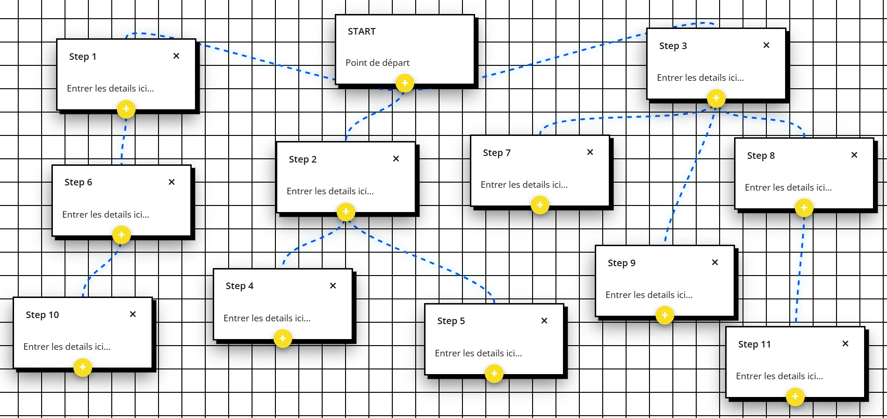

# Éditeur de diagrammes

Éditeur de diagrammes léger pour structurer ses idées.  
Création de nœuds, drag & drop, édition du contenu textuel, liens automatiques.

---

## Sommaire
- Stack  
- Avancement  
- Contributions  
- Utilisations

## Stack
Réalisé avec JavaScript vanilla.

## Avancement
Le projet n’est pas terminé et doit encore être amélioré.

## Contributions
N'hésitez pas à ouvrir une pull request ou à proposer une amélioration.

## Utilisations
L’éditeur peut être installé comme une application (PWA) pour un usage plus fluide, sans barre d’adresse.
